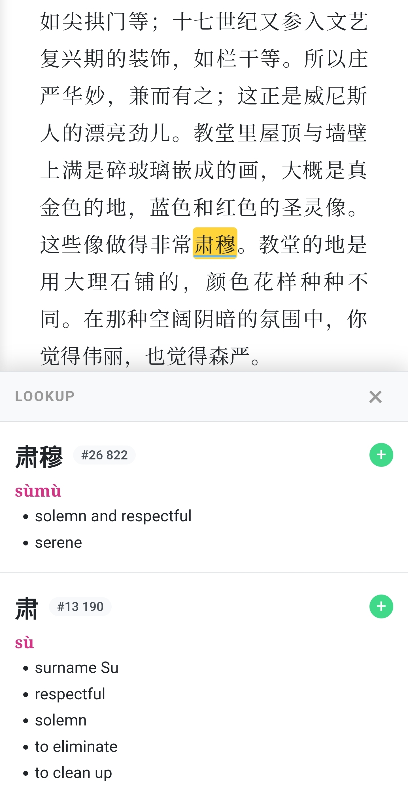

# Mogao

Mogao is a mobile-first EPUB reader and video player for Chinese learners with instant dictionary lookups and Anki flashcard creation.

<p align="center">
  
</p>

## Features

- 📖 EPUB reader
- 📺 Video player with subtitles under the video or in the sidebar
- 🔍 Instantaneous dictionary lookups with just a tap
- 🧠 Seamless Anki flashcard creation
- ✨ Effortless flashcard enrichment with pinyin, translation and audio
- 🧩 Automatic i+1 sentence detection with the new word highlighted
- 📚 Custom dictionary generation per book/video for rare and specific words
- 📱 Designed for use on phones and tablets

## Quickstart

Run the following commands to launch Mogao. For more specific instructions and configuration, check the following section.

Install Anki with AnkiConnect, FFmpeg, yt-dlp, uv and unzip using your system's package manager or your preferred method.


```shell

git clone https://github.com/haussbrandt/mogao.git
cd mogao
uv sync
cp .env.example .env
cp config.example.toml config.toml

# Set the output of the next command as MOGAO_SESSION_SECRET in .env:
uv run python -c 'import secrets; print(secrets.token_hex(32))'

# Set the output of the next command as MOGAO_ADMIN_HASH in .env:
uv run python -c 'import bcrypt, getpass; p = getpass.getpass("Admin password: "); print(bcrypt.hashpw(p.encode(), bcrypt.gensalt()).decode())'

# Also set your API keys in .env

# You most likely also need to modify the Anki deck name and fields to match your deck

# Setup the dictionaries following the "Dictionary setup" section below

uv run server.py

# You can now open the URL in your browser
```

## Installation and configuration

### Prerequisites

Mogao is based on Python 3.12+ and it's the only hard dependency of this project. To use all the features, there are also these optional dependencies:
- Anki + AnkiConnect - necessary for creating flashcards
- FFmpeg/ffprobe - necessary for the audio and video features
- yt-dlp - necessary for downloading videos from URLs

The recommended setup also uses:
- uv - the recommended way to manage Python dependencies
- unzip - unpacking the dictionary files
- Caddy or another proxy - HTTPS deployment

### Config files

Mogao reads the configuration options from two files that need to be present in its root directory: `.env` for secrets and `config.toml` for other settings. Copy the provided examples to get started:

```shell
cp .env.example .env
cp config.example.toml config.toml
```

#### Generating secrets and API keys

Run the following command to generate the `MOGAO_SESSION_SECRET` value:
```shell
uv run python -c 'import secrets; print(secrets.token_hex(32))'
```

Run the following command to generate the admin password hash using an interactive prompt:
```shell
uv run python -c 'import bcrypt, getpass; p = getpass.getpass("Admin password: "); print(bcrypt.hashpw(p.encode(), bcrypt.gensalt()).decode())'
```

Place the outputs in `.env`.

You can also change the username at this point.

Put the API keys to the AI services in the same file. LLM text post-processing
uses `POSTPROCESSING_API_KEY`, while book and video dictionary generation use
`DICTIONARY_GENERATION_API_KEY`.

#### config.toml

You can configure certain features of Mogao like the Anki deck and field names, paths, AI models used etc. in `config.toml`.

If you don't want to use specific features, you can disable them by setting their `enabled` value to `false`.

The text post-processing and dictionary generation sections each accept their
own OpenAI-compatible `base_url` and `llm` model. This allows the two features
to use different providers.

### Dictionary setup

Mogao works best with a popup dictionary, but dictionary data is not bundled with this repository.

I recommend using [CC-CEDICT](https://www.mdbg.net/chinese/dictionary?page=cedict), but any dictionary in CC-CEDICT format should work, too.

Download the `.zip` version. The path to the unzipped file should match the path specified under the `dictionary` field in the `[paths]` section of the `config.toml`.

Mogao also supports optional frequency dictionaries.
I recommend using the ones you can find [here](https://zenith-raincoat-5cf.notion.site/Yomitan-Setup-TTS-f454d76706834716bf93919b89145e57) under the name `zhfreq_lists.zip`, but others following the same format should work, too. You can add as many of them as you want - Mogao will calculate the harmonic mean. They should form a nested structure inside the directory specified under the `frequencies` field in the `[paths]` section of the `config.toml`.

You can achieve this by running the following commands after downloading both files:
```shell
mkdir -p dicts/freqs
unzip path/to/cedict_1_0_ts_utf-8_mdbg.zip -d dicts
unzip -q path/to/zhfreq_lists.zip -d dicts/freqs && for archive in dicts/freqs/*.zip; do unzip -q "$archive" -d "${archive%.zip}"; done
```

Run the following command from the repository root. It reads the configured files and generates `static/dict.json`:
```shell
uv run build_dictionary.py
```

### Video URL configuration

Video routes are mounted internally under `/video`. By default, the generated
video links also use `/video`, so the video library is available directly at:

```text
http://localhost:8123/video/
```

To expose the video library at the root of a separate domain, configure the
reverse proxy to add the internal `/video` prefix and set
`MOGAO_VIDEO_BASE_PATH` to an empty string:

```dotenv
MOGAO_VIDEO_BASE_PATH=
```

For example, with Caddy:

```caddyfile
video.example.com {
	rewrite * /video{path}
	reverse_proxy localhost:8123
}
```

To expose it under another public prefix, set that prefix instead:

```dotenv
MOGAO_VIDEO_BASE_PATH=/videos
```

## HTTPS reverse proxy

When exposing Mogao outside a trusted local network, place it behind an HTTPS reverse proxy.

## License

Mogao is licensed under the [MIT license](LICENSE). Portions of the code are derived from third-party projects; see [Third-Party Notices](THIRD_PARTY_NOTICES).
